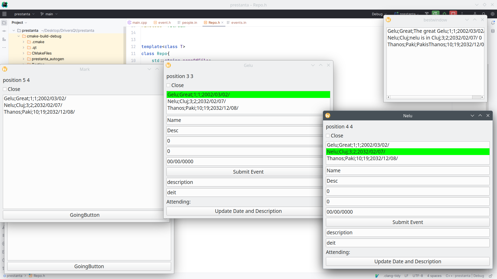

# EvetnsInQt

This is an application made using the QT framework with C++ and layerd architecture.

The application's purpose is to provide a GUI for managing events.

It provides 2 different window types. One for event organisers and one for event participants. The live synchronisation between all the openened windows is done using the Obsserver design pattern.

In this screenshot 'Gelu' and 'Nelu' are event organisers while Mark is a event participant.
All the data shown in these windows is read and then updated into the files 'events.in'
and 'organisers.in'.

There is also another window provided which is the "bestwindow". This window show the events that, currently, have the most attending participants.
